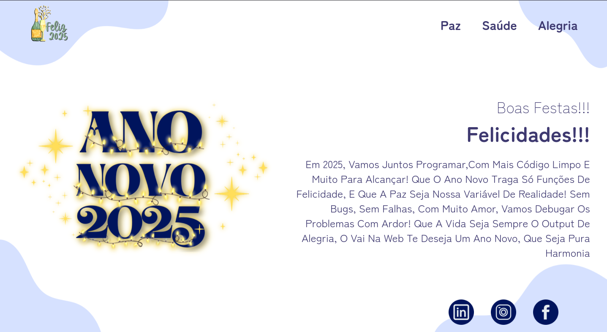

# 🎉 **Bem-vindo ao Ano Novo 2025** 🚀

Este projeto é uma recriação de um layout fornecido no curso Full-Stack do Vai na Web. Ele celebra a virada do ano com animações de fogos de artifício e confetes, proporcionando uma experiência interativa e visualmente atraente.

## ℹ️ Sobre o Projeto

O **Ano Novo 2025** é um projeto desenvolvido como atividade no curso Full-Stack do Vai na Web. O objetivo principal foi recriar um layout fornecido no Figma, utilizando ferramentas modernas do ecossistema front-end. Ele conta com animações representando fogos de artifício e confetes para celebrar a virada do ano.

Você pode conferir o projeto publicado [aqui](https://ano-novo-2025-kappa.vercel.app).

## 🔧 Ferramentas Utilizadas

O projeto foi construído utilizando as seguintes tecnologias:

- **React**: Biblioteca JavaScript para criação de interfaces de usuário.
- **Vite**: Ferramenta de build rápida para desenvolvimento de projetos front-end.
- **SCSS**: Extensão do CSS que adiciona recursos como variáveis e aninhamento.
- **@fireworks-js/react**: Biblioteca para criação de animações de fogos de artifício.
- **react-confetti**: Biblioteca para renderizar confetes na tela.

## 🚀 Executando o Projeto

Siga as instruções abaixo para configurar e executar o projeto em seu ambiente local:

### Passos para Executar

1. **Clone o repositório:**

   ```bash
   git clone https://github.com/Davi-D18/ano-novo-2025.git
   ```

2. **Navegue até o diretório do projeto:**

   ```bash
   cd ano-novo-2025
   ```

3. **Instale as dependências:**

   ```bash
   npm install
   ```

4. **Execute o projeto em modo de desenvolvimento:**

   ```bash
   npm run dev
   ```

5. **Abra no navegador:**

   O projeto estará disponível em:

   ```
   http://localhost:5173
   ```

## 🌐 Estrutura do Projeto


```plaintext
src/
├── assets/                   # Contém ícones, imagens e logos.
│   ├── icons/                # Ícones da aplicação.
│   │   
│   ├── imgs/                 # Imagens diversas.
│   │   
│   └── logo/                 # Pasta com a logo.
│       
├── components/               # Componentes 
│   ├── animatedwrapper/
│   ├── footer/
│   └── Header/
│
├── pages/                    # Páginas do projeto.
│   └── Message/
│       ├── style/            # Estilos específicos
│       └── Message.jsx
│
├── styles/                   # Arquivos SCSS
│   ├── app.module.scss       # Estilos modularizados do App.
│   ├── global.scss           # Estilos globais da aplicação.
│   └── transition.scss       # Estilos para transições usado no componente animatedwrapper.
│
├── App.jsx                   # Componente raiz da aplicação.
└── main.jsx                  # Ponto de entrada da aplicação.

```

## ✨ Screenshot



## Links

### Design

* [Figma](https://www.figma.com/design/n6UEdCbVWyPzPwHWsdhHCM/Ano-Novo-2025?node-id=0-1&p=f&t=OFw1gh9MO6SZOqyJ-0)

### Deploy

* [Vercel](https://ano-novo-2025-kappa.vercel.app)

## Estrutura Inicial
Esse projeto foi iniciado a partir de outra estrutura pronta, uma estrutura configurada para projetos React com SCSS modularizado e outras ferramentas. Acesse aqui: [link](https://github.com/Davi-D18/b_react-scss)
